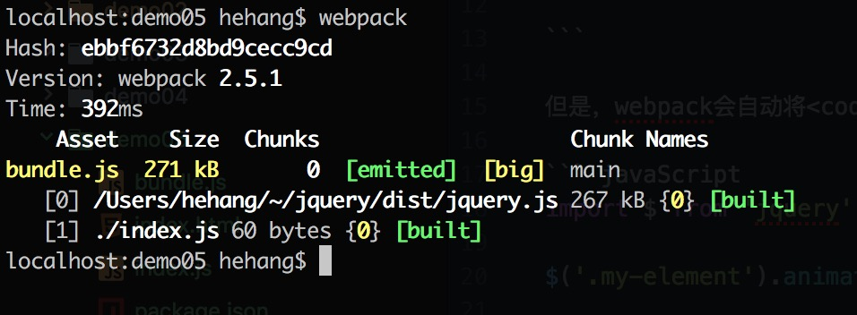
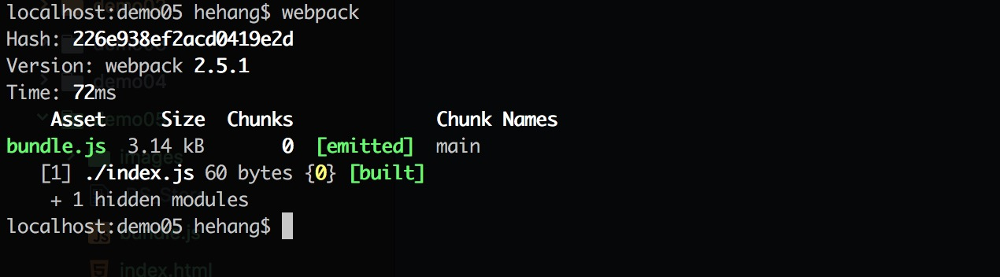

### Externals:外部扩展

有时候，我们可能不需要将某些 <code>lib | plugin</code> 文件打包进<code>bundle</code>中，而是在运行时(runtime)再去从外部获取这些扩展包(external package)。

例如，从 CDN 引入 jQuery，而不是把它打包：

##### index.html

```html

<script src="https://code.jquery.com/jquery-3.1.0.js" ></script>

```

但是，webpack会自动将<code>import</code> 导入的文件打包至<code>bundle.js</code>。

``` javaScript
import $ from 'jquery';

$('.my-element').animate(...);

```

此刻编译<code>bundle.js</code>足有<code>271KB</code>，其中包含了<code>jquery.js</code>，而同时我们通过script标签导入的jquery也被加载，导致jquery 2次加载。




我们不希望webpack打包<code>jquery</code>,即需要在<code>webpack.config.js</code>中声明外部依赖。

```javaScript
// webpack.config.js
externals: {
  jquery: 'window.jQuery'
}
```


此刻编译后的<code>bundle.js</code>仅有<code>3.14KB</code>。




[扩展知识01](http://www.css88.com/doc/webpack2/configuration/externals/)
